# Car Rental System | CarQuest Website

## Overview

CarQuest is a car rental system website, that automates the car reservation process, allowing customers to create accounts, reserve cars, and make payments efficiently. It also provides functionality for car registration, status updates, advanced searches, and generating business-critical reports.

## Features
- Customer Registration: Sign up and create your own account
- Car Management: Register new cars and update existing ones, update their status as well (active, rented, out of service)
- Customer Reservation: Search for available cars, and reserve them
- Search Functionality: Basic search options for customers to filter cars by model, year, plate ID, etc..
- Advanced Search: Advanced search functionality specific for admins
- Reporting: Generate reports on car statuses, customer reservations, daily payments, and more.

## System Design:
## Database Design
### Entity Relationship Diagram (ERD)
[mo2aqqatan](README.md) 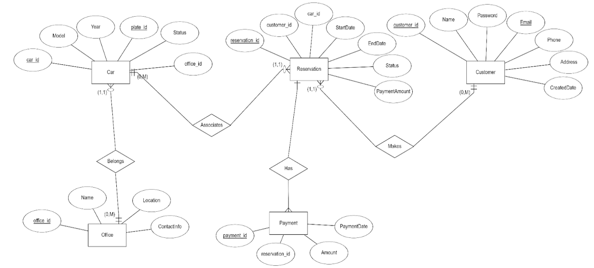

### Schema
[mo2aqqatan](README.md) 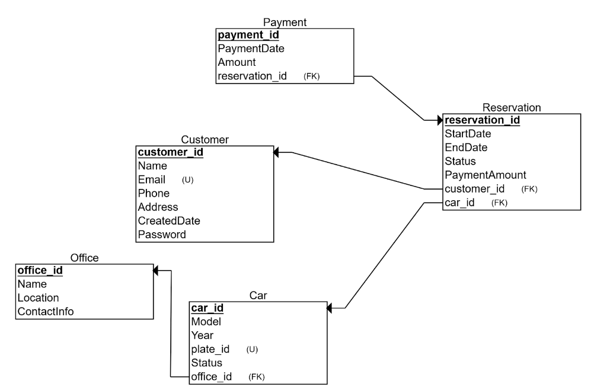

## User Interface
### Home Page
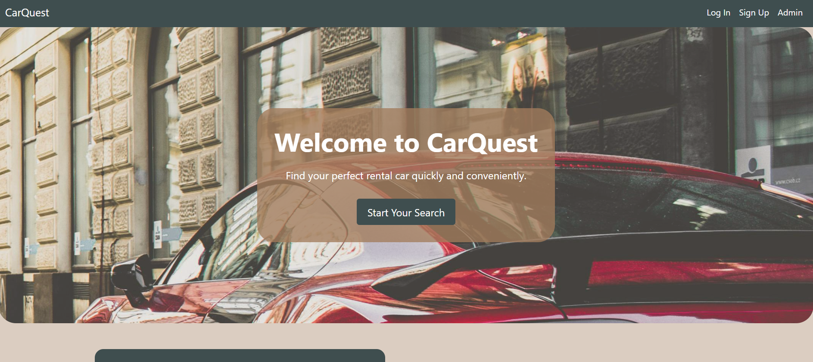
Home page containing an about section and contact info, and a call-to-action search button

### Registration
1. Customer Signup

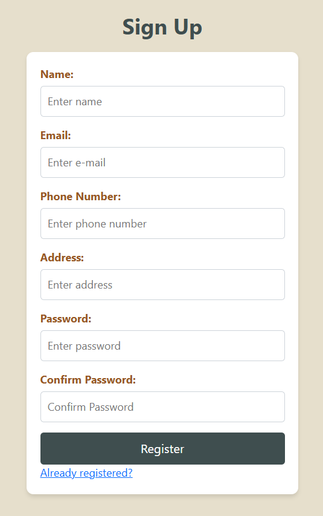

2. Customer Login

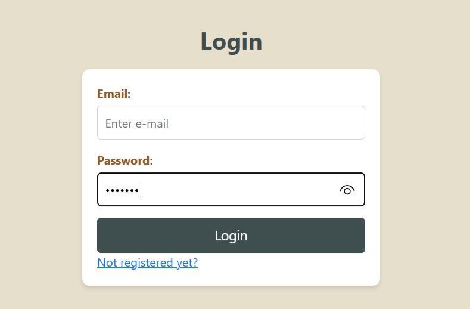

3. Admin Login
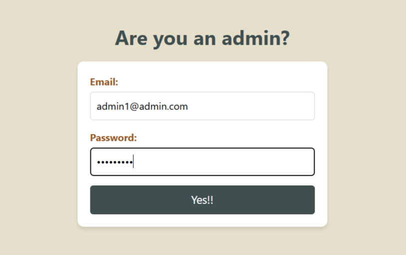

### Admin Dashboard
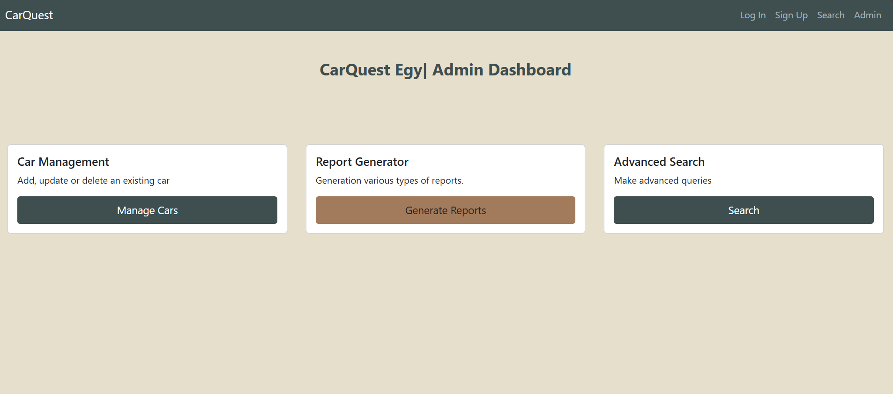

1. Car Management: Admins can add, or update cars.

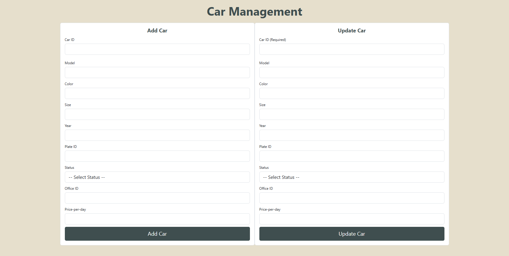

2. Advanced Search: Admins can search by car, customer info, or even registration date

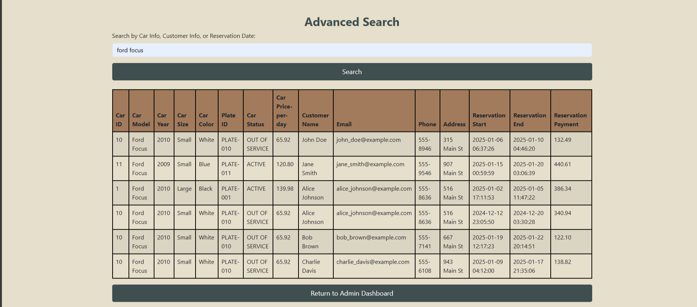

3. Reports Generation
- 5 types of reports can be generated
    1. Reservations within a period
    2. Reservations of a specific car
    3. Status of all cars on a specific days
    4. Reservations of a specific customer
    5. Daily Payments

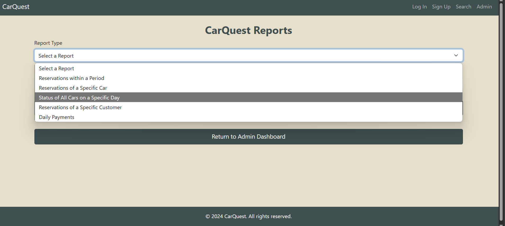

Example
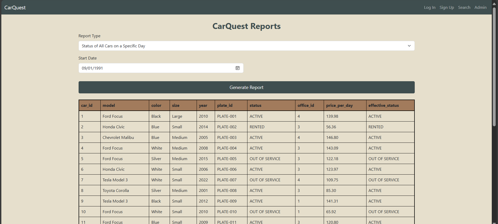

### Frontend Design System
1. Font type: System UI Stack
2. Color Palette:
    - bg color: #E6DFCC
    - headings, buttons: #3F4E4F
    - button hover: #A27B5C

## Usage
1. Installation
- Clone the repository:
    'git clone [Car Rental System](https://github.com/Asmaa-Ghanem/Car-Rental-System.git)
- Install XAMPP (if not already installed) for local server setup. [XAMPP Installation](https://www.apachefriends.org/download.html)
- Set up the database using XAMPP's MySQL service.
- Make sure to place the cloned project directory inside the htdocs folder of your XAMPP installation directory
    - The default path is typically: C:\xampp\htdocs\

2. Running the Application:
- Start XAMPP and ensure both Apache and MySQL services are running
- Import the database schema "DDL.sql" and data "DML.sql" to MySQL via phpMyAdmin
- Open your browser and navigate to  http://localhost/Car-Rental-System to access the application

3. Testing:
- The system includes mock data for testing. (You'll find them in DML.sql script)

## Technologies Used:
- Backend: PHP, MySQL
- Frontend: HTML/CSS, Bootstrap, js
- Development Environment: XAMPP (Apache, MySQL, PHP)

## Future Enhancements:
- Testing: Unit tests and integration tests for database interactions
- Mobile App: Develop a mobile version for customers to manage reservations on the go.
- Customer Reviews: Add a review system for customers to rate cars and services.

